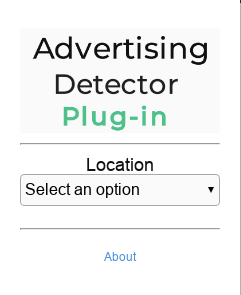

<div align="center">
  <h1>
    Advertising Detector Plugin  
  </h1>
  <p>
    <strong>This Plugin was developed about <a href="https://github.com/EmailThis/extension-boilerplate">extension-boilerplate</a> </strong>
  </p>
  
</div>  


***Spanish Version*** [here](./Documentation/es/README.md)  

## Features  
  + You can set the accounts where then it's going to get the advertising to monitor.  
  + You can set the Backend API Url where it's going to send the info.  
  + You can build to Chrome, Mozilla and Opera browsers.  
  + More features [here](https://github.com/EmailThis/extension-boilerplate#features)  

## Install  
  + Clone the repository  ```git clone https://github.com/cambalab/advertising-detector-plugin ```  
  + Run ```npm install```  
  + Run ```npm run build```

## Build for each Browser
  + For Chrome and Opera browsers
    - **Chrome:** run ```npm run chrome-build```   
    - **Opera:**, run ```npm run opera-build```  
  + For Mozilla **Firefox browser**
    - Run ```npm run firefox-build```  

  In the directory ```advertising-detector-plugin/build/``` will be create a new folder for each browser with the builded version.  
  + For load the extension in Chrome and Opera browsers, open it and navigate to ```chrome://extensions``` then choose *"Developer Mode"*. Do click on *"Load unpacked extension"* and from the file system load  ```advertising-detector-plugin/build/chrome``` or ```advertising-detector-plugin/build/opera```  
  + For load the extension in Firefoz browser, open it and navigate to ```about:debugging``` then choose *"Load Temporary Add-on"* and from the file system load  ```advertising-detector-plugin/build/firefox```

## Packaging  
  + Run ```npm run chrome-dist``` , ```npm run firefox-dist``` or ```npm run opera-dist``` and will be create a **zipped** file in ```advertising-detector-plugin/dist``` for the browser that has been choosed, ready to upload to the AppStore.

## Settings    
  + In the file `advertising-detector-plugin/src/config.js` is an array with the accounts that going to monitor.

  ```javascript
  "accounts": [
    {
      "name": "Account Name", // for example: Facebook
      "page_id": "Page id", // for example: 185150934832623
      "page_name": "Url page" // for example: https://www.facebook.com/enespanol/
    }
  ],
  ```  

  + For configure the location, add the options in the array *locations*  

  ```javascript
  "locations": [
    "Select an option",
    "City one",
    "City two",
    "City three",
    "City four",
    "City five",
    "City six",
    "City seven",
    "City eight",
    "City nine",
    "City ten"
  ],
  ```  

  + Backend API Url, where it will be send the information  

  ```javascript
  "adUri": "API Backend URL", // Backend url
  ```  

  + To set the *HTML* selectors with that Facebook define the **Sponsored** posts (advertising)

  ```javascript
  "fbAds": {
    "mainContainerQuerySelector": "[id^='topnews_main_stream_'",
    "profileIdContainerQuerySelector": "a[title='Perfil']",
    "targetAdWord": "Sponsored",
    "postQuerySelector": "hyperfeed_story_id_",
    "postSubtitleQuerySelector": "[id^='fe_edsubtitle']",
    "postIdQuerySelector": "[name=ft_ent_identifier]"
  }
  ```
